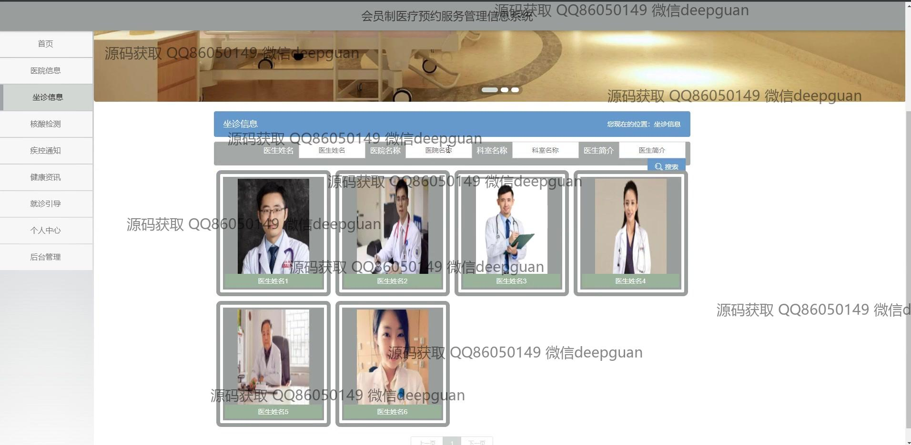
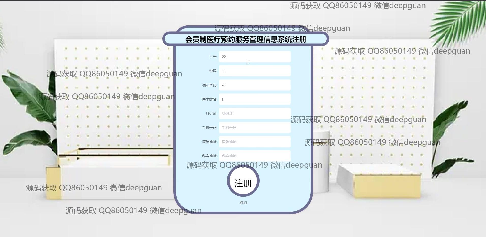
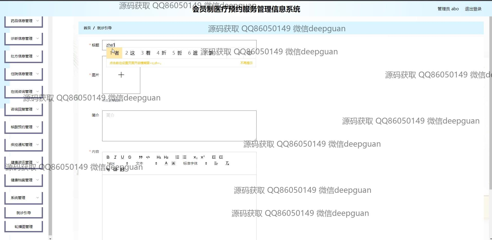

<h1 align="center">会员制医疗预约服务管理信息系统</h1>

## 简介
会员制医疗预约服务管理信息系统：角色分为管理员和用户；包括会员管理、医院信息管理、预约挂号、在线咨询、核酸检测管理等功能，旨在优化医疗服务流程，提高用户体验与操作效率。    --计算机毕业设计源码；毕设源码；java毕业设计源码

## 联系方式

<h3 align="center">获取完整代码与数据库文件 + 微信：deepguan QQ: 86050149 QQ群: 783742310</h3>

<h3 align="center">可帮忙远程部署 包运行成功！提供远程部署、修改代码、设计文档指导、代码讲解等服务！</h3>

## 功能介绍（完整见运行截图）
管理员：基本功能包括登录、注册和系统退出，能够在系统主页进行导航，通过菜单管理多种信息模块，如会员管理、医生管理、医院信息管理、处方信息管理和支付管理。支持医院及药品信息的输入和编辑，允许上传相关图片并管理公告与咨询回复，具有对医疗预约审核与挂号预约的管理，还能查看和处理用户的注册与挂号申请，支持系统后台设置调整和数据统计分析。

用户：通过登录和注册后访问个人中心，可以查看和修改个人信息，管理预约记录和在线咨询。可以在系统中进行挂号预约、查看医生信息及坐诊安排，并通过在线支付完成费用结算。支持核酸检测、药品信息查询及订单管理，能够在服务管理系统中查看健康档案、医疗资讯及医院信息，并参与在线咨询或获取疾病通知和健康资讯的更新。

## 运行截图

本代码来源于网络,仅供学习参考使用!

